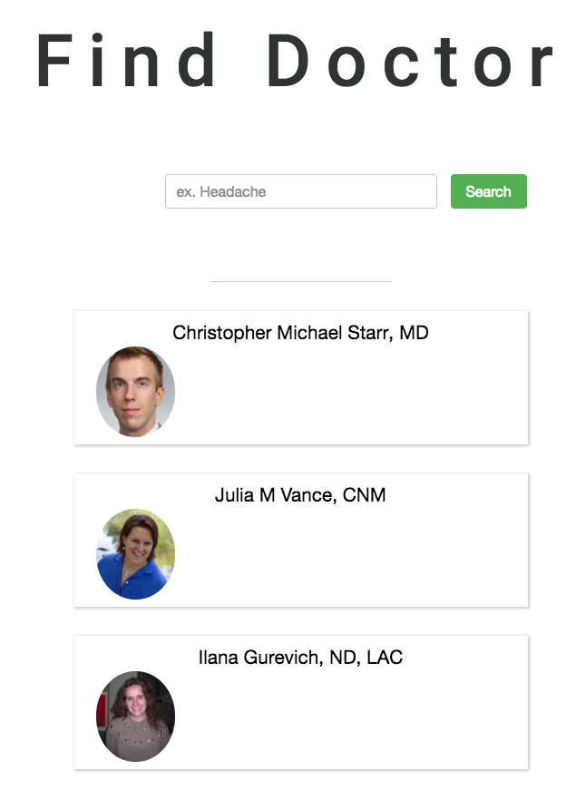
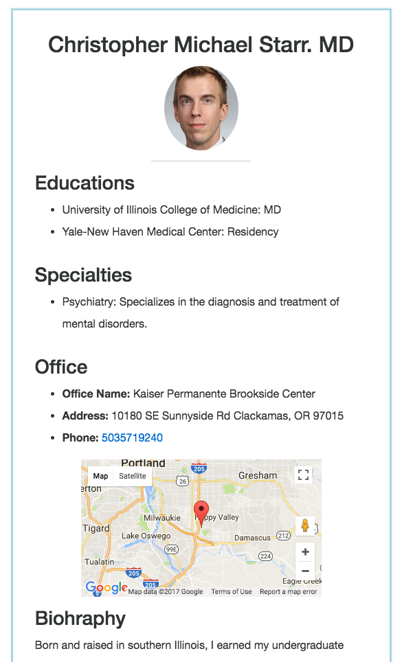

# BetterDoctor React

#### Koji Nakagawa

## Description
* This program search doctors by query and your current location.






## Prerequisites
You will need the following things properly installed on your computer.

* [BetterDoctor API Key](https://developer.betterdoctor.com/)
* [Node.js 6.10~](https://nodejs.org/) (with NPM)


### Getting Started
```
> $git clone https://github.com/KNaka88/ReactBetterDoctor.git
> $cd ReactBetterDoctor
> Insert your BetterDoctor API Key to api_key.js
> $npm install
> $npm start
```
## Technologies Used
  * React/Redux
  * npm

## License
  _Copyright (c) 2017 **Koji Nakagawa**_

  _Permission is hereby granted, free of charge, to any person obtaining a copy
  of this software and associated documentation files (the "Software"), to deal
  in the Software without restriction, including without limitation the rights
  to use, copy, modify, merge, publish, distribute, sublicense, and/or sell
  copies of the Software, and to permit persons to whom the Software is
  furnished to do so, subject to the following conditions:_

  _The above copyright notice and this permission notice shall be included in all
  copies or substantial portions of the Software._

  _THE SOFTWARE IS PROVIDED "AS IS", WITHOUT WARRANTY OF ANY KIND, EXPRESS OR
  IMPLIED, INCLUDING BUT NOT LIMITED TO THE WARRANTIES OF MERCHANTABILITY,
  FITNESS FOR A PARTICULAR PURPOSE AND NONINFRINGEMENT. IN NO EVENT SHALL THE
  AUTHORS OR COPYRIGHT HOLDERS BE LIABLE FOR ANY CLAIM, DAMAGES OR OTHER
  LIABILITY, WHETHER IN AN ACTION OF CONTRACT, TORT OR OTHERWISE, ARISING FROM,
  OUT OF OR IN CONNECTION WITH THE SOFTWARE OR THE USE OR OTHER DEALINGS IN THE
  SOFTWARE._
